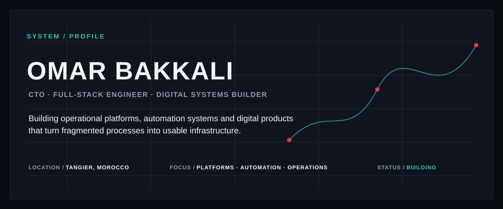
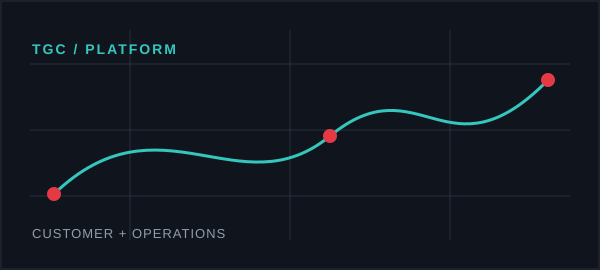
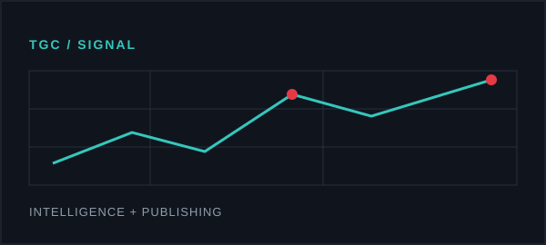
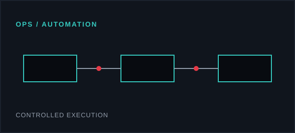
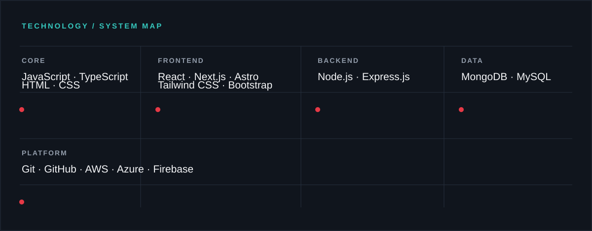
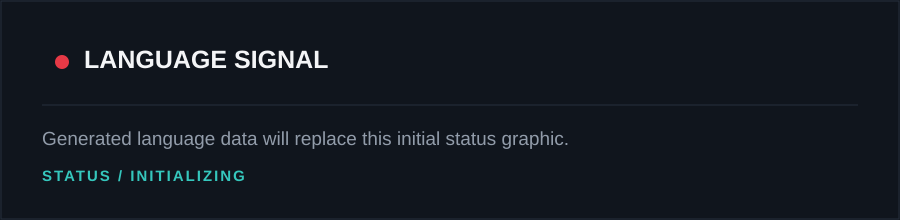
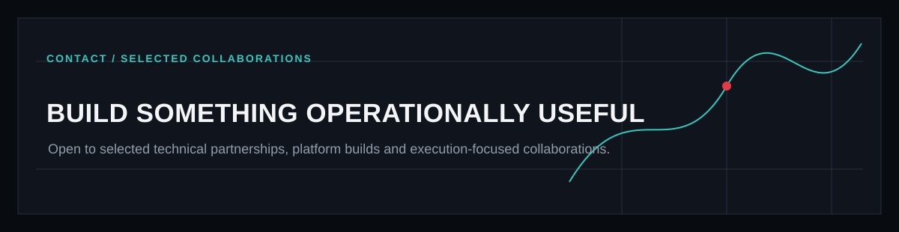

  

  <a href="https://www.linkedin.com/in/omarbakkali-tech/">LinkedIn</a>

## 01 / CURRENT MISSION

Omar Bakkali works where engineering, operations and business execution meet. As CTO at Top Gun Cargo, he builds digital systems that make logistics work easier to understand, operate and improve—from customer-facing platforms and internal operational systems to publishing and intelligence tools. His work combines full-stack engineering, workflow automation and technical delivery, with an emphasis on turning fragmented processes into useful, maintainable infrastructure.

## 02 / SELECTED SYSTEMS

<table>
  <tr>
    <td width="28%" valign="top"></td><td valign="top"><strong>Top Gun Cargo Digital Platform</strong>  A customer-facing and operational logistics platform covering service discovery, account access, quotation flows and digital logistics capabilities.  PLATFORM ARCHITECTURE · FRONTEND ENGINEERING · CUSTOMER WORKFLOWS · LOGISTICS TECHNOLOGY</td>
  </tr>
  <tr>
    <td width="28%" valign="top"></td><td valign="top"><strong>TGC Signal</strong>  A logistics intelligence and publishing platform built with Astro, React, TypeScript and Sanity, with search, editorial content and operational calculators.  ASTRO · REACT · TYPESCRIPT · SANITY · SEARCH · OPERATIONAL TOOLS</td>
  </tr>
  <tr>
    <td width="28%" valign="top"></td><td valign="top"><strong>Operations Automation</strong>  Controlled automation systems built to reduce repetitive operational work, improve process visibility and support reliable execution.  WORKFLOW DESIGN · SYSTEM INTEGRATION · AUTOMATION · OPERATIONAL CONTROLS</td>
  </tr>
</table>

## 03 / ENGINEERING CAPABILITIES

<table>
  <tr><td width="50%" valign="top"><strong>Product &amp; Platform Engineering</strong> Design and build usable systems around real operational requirements.</td><td width="50%" valign="top"><strong>Frontend Systems</strong> Develop responsive interfaces, structured component systems and customer-facing workflows.</td></tr>
  <tr><td valign="top"><strong>Backend &amp; Integration</strong> Connect applications, services, data and operational processes through maintainable interfaces.</td><td valign="top"><strong>Workflow Automation</strong> Automate repetitive work while preserving visibility, validation and human control.</td></tr>
  <tr><td valign="top"><strong>Technical Leadership</strong> Translate business requirements into clear technical priorities and executable delivery plans.</td><td></td></tr>
</table>

## 04 / TECHNOLOGY SYSTEM

## 05 / ENGINEERING SIGNALS

  
  

Metrics are refreshed weekly. If the generated files are temporarily unavailable, GitHub’s native profile activity remains the source of record.

## 06 / WORKING PRINCIPLES

<table>
  <tr><td><strong>01</strong></td><td>Build around real operational constraints.</td></tr>
  <tr><td><strong>02</strong></td><td>Prefer clear systems over impressive complexity.</td></tr>
  <tr><td><strong>03</strong></td><td>Automate repeatable work without hiding critical decisions.</td></tr>
  <tr><td><strong>04</strong></td><td>Treat design, engineering and operations as one delivery system.</td></tr>
</table>

  <a href="https://www.linkedin.com/in/omarbakkali-tech/">LinkedIn</a>

